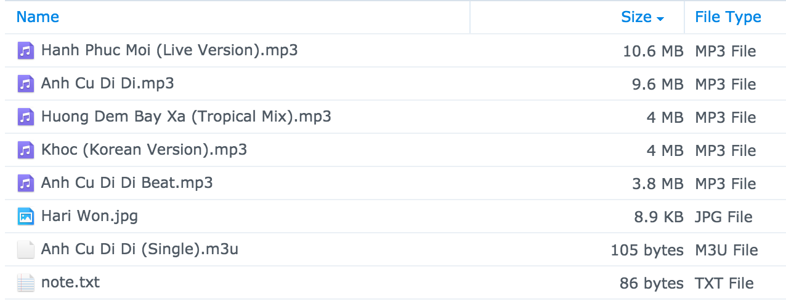
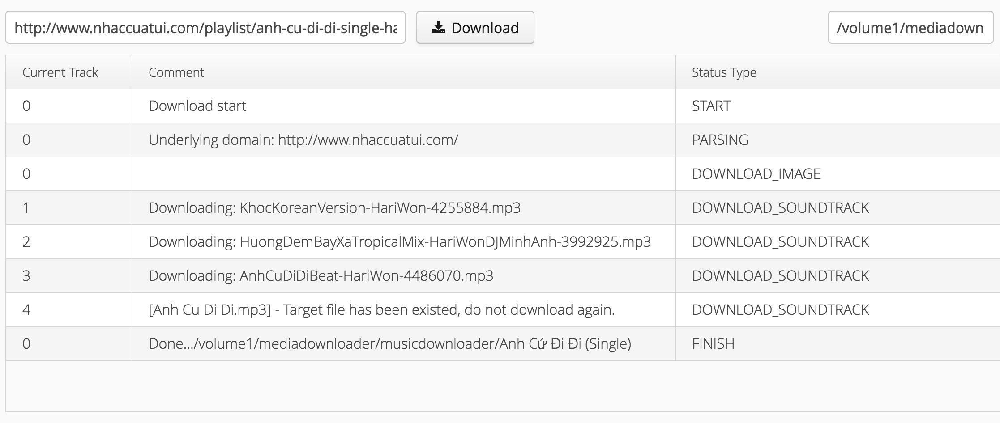
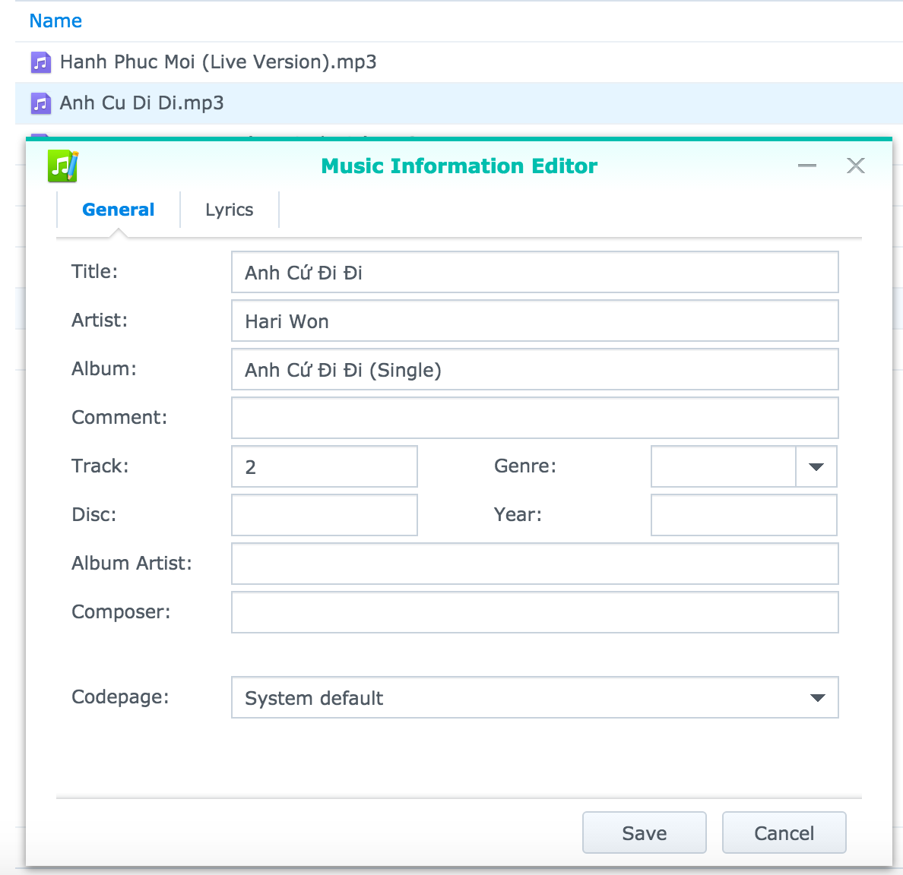

# media-downloader

Download audio album in multiple sites, until now 

- one album includes:
    + All audio tracks (mp3 or flac)
    + A cover (normally in jpg format)
    + m3u: playlist file, use this file to import into itunes or play album
    + note.txt: url reference

**It supports to download from these sites:**

- Nhac.vui.vn
- Nhaccuatui.com
- Mp3.zing.vn
- Chiasenhac.vn (download flac only - ignore if there's no flac file in album)

**Generate playlist**

Application download multiple file then create a playlist in m3u format.

**Tagging**

By default, the downloaded file name does not look good, the application correct and make it readable.
Beside that, all audio files will be tagged in following fields:

    + Song title
    + Track number
    + Total track number
    + Album
    + Artist

# build
- System requirement:
    - java 8
    - maven

- In order run as application (click and run): `mvn package -P app`
- Build war file to run on tomcat or jetty: `mvn package -P web`

# License
MIT, I think. Feel free to use this source code.

# Demo
Demo site:
http://tdang.synology.me:7070/musicdownloader/

Then see the result here, you can also download the album to your computer
http://gofile.me/6r9Tw/n0svXJdrK

Note: Don't hurt my cheap NAS :(

Thanks
